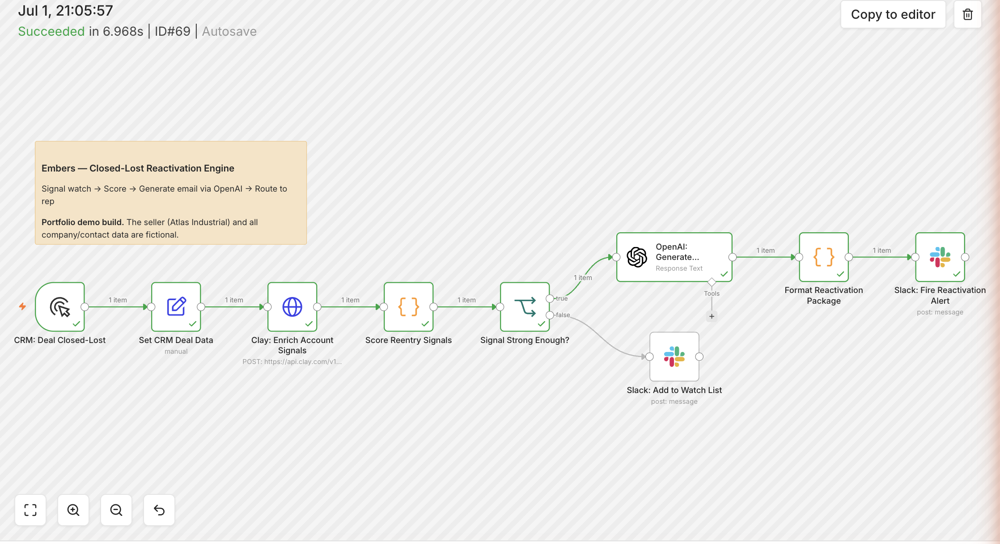

# Embers — Closed-Lost Reactivation Engine

**Closed-lost isn't dead. It's dormant — and it re-warms on a signal, not a schedule.**

A working n8n engine that watches closed-lost accounts for the moment their blocker dissolves — then scores the signal, drafts a reactivation email, and routes an actionable alert to the rep. On top of the engine, this repo documents the full program design it was built to power: a signal-triggered gifting + outreach motion with holdout-group measurement.

The seller ("Atlas Industrial," a predictive-maintenance company) and every account, contact, and deal in this repo are fictional.



---

## The thesis

Deals lost to timing or budget didn't say "no" — they said "not now." They qualified, took meetings, had budget conversations. Then circumstances got in the way: a capex freeze, a fiscal-year reset, a reorg.

Circumstances change. Budgets reset, new leaders get hired, plants expand, machines fail. The reason these deals stay cold isn't that they're bad — it's that nobody is watching for the moment they get good again. A rep doing a quarterly sweep is guessing. A signal-based system flips it: **the account tells you when it's ready, and you're the first one back in the room.**

## What's built vs. what's designed

Being precise about this matters:

- **Built (this repo, runs end to end):** the engine — closed-lost trigger → account enrichment → weighted signal scoring → threshold gate → AI-drafted reactivation email → Slack alert card with one-click outcome logging. The demo GIF above is a real execution. The enrichment step is scaffolded as a Clay HTTP call with a graceful mock-data fallback, so the workflow runs green with no Clay key.
- **Designed (documented below, not built):** the gifting layer, the contact-replacement waterfall, loss-reason analysis from call transcripts, and the holdout-group measurement framework. These are the program the engine was designed to grow into — rails first, program second.

## The engine

```
CRM: Deal Closed-Lost (trigger)
  → Clay: Enrich Account Signals     (HTTP call; mock fallback baked in)
  → Score Re-entry Signals           (weighted model, threshold ≥ 30)
  → Signal Strong Enough?
       ├─ yes → OpenAI: Generate Reactivation Email
       │          → Format Reactivation Package
       │          → Slack: Fire Reactivation Alert   (Block Kit card, one-click logging)
       └─ no  → Slack: Add to Watch List
```

Scoring as built: **new decision-maker hire +30 · relevant job posting +25 · headcount growth +20 · recent funding +15.** One strong signal or two stacked weak ones clear the bar; weak signals alone never trigger outreach.

The demo scenario: Cascade Metalworks, a $36K deal lost five months ago to a capex freeze. A new Maintenance Supervisor was hired 34 days ago, they're posting for a Reliability Engineer, and headcount is up 14% — score 75/100. The drafted email references the new hire and the budget timing naturally, and the rep gets the full context in one Slack card.

## The signal framework

The word "intent" gets hand-waved a lot. Here it means something specific: **observable evidence that the reason you lost the deal no longer applies.** A website visit is activity. A new maintenance leader at an account you lost on budget is intent.

Two gates keep the program honest:

1. **Eligibility (static):** reached qualified pipeline · lost to timing / budget / no-decision (not competitor lock-in, not bad fit) · still ICP · no open opportunity.
2. **Intent (dynamic):** a scored signal that times the re-approach.

The full program design extends the built scorer into a tiered stack:

| Tier | Signal | Why it predicts re-entry |
|---|---|---|
| 1 | New decision-maker in the buying function | New budget authority, zero ownership of the old "no" — known-contact plays win ~37% vs ~19% cold ([Champify](https://www.champify.io/resources/the-impact-of-tracking-job-changes-value-report)) |
| 1 | Budget/fiscal event — new FY, capex announcement, funding, expansion | Directly answers "no budget / bad timing" |
| 2 | Hiring for roles the product serves | Investing in the exact function |
| 2 | Headcount growth >10% in 6 months | Scaling fast strains existing capacity |
| 3 | Acute pain in the news — downtime, recall, safety event | The cost of inaction just spiked |
| 3 | Re-engagement / incumbent-vendor churn | Soft intent; stacks with others |

Weights are a starting model, not a tuned system — rep dispositions ("good signal / wrong contact / not ready") feed back into the scorer, and signal types that don't out-convert the holdout get killed.

## The program design on top

### The motion: nine stages, two human touches

```
Dormant → Triggered → Verified → Composed → Approved → Activated → Delivered → Engaged → SQL
```

Fully automated except two deliberate gates: a human **approves the spend** (real money per account, brand on the line) and a human **works the meeting**. Automation does the watching, enriching, writing, and routing; people do judgment and relationship.

### Architecture: one job per tool

CRM (system of record) → n8n (orchestration) ↔ Clay (signal detection + enrichment) ↔ LLM (loss-reason analysis → gift + copy) → gifting platform (Sendoso/Reachdesk-class, fulfillment + delivery webhooks) → Slack (rep interface) → back to CRM (activity logged, stage advanced).

The risky part of any cross-tool automation is the handovers, so each hop carries safeguards: idempotency keys (never double-gift), account-level dedup, a suppression check before every send (open opp / DNC / recent touch), address validation before shipping, and retry logic on every API call. The fastest way to lose rep trust is to gift an account someone closed last week.

### The counterintuitive part: the contact leaving is a buying signal

Most teams treat "our champion left" as the deal dying. It's the opposite — their replacement is rebuilding the toolset with no loyalty to last year's "no." The enrichment waterfall verifies whether the original contact is still there; if they're gone, it finds and verifies the new leader in that function. Selling to a known, warm entry point at ~37% win rates versus ~19% cold (Champify, 2025) is the strongest single argument for the whole motion.

### Loss-reason intelligence

A CRM picklist says "budget." The call recording says *"CFO froze all capex through end of FY after the Q2 miss."* That specificity is the difference between a generic check-in and a credible re-approach. The design feeds both the structured loss reason and the call transcript (e.g., Gong) to an LLM that outputs a structured package: loss summary, gift tier + SKU, note-card copy, rep email draft, and a talk track. The rep edits and sends — it's a draft, never an auto-send.

### Persona-true gifting

A practitioner and an executive want opposite things, and getting this wrong makes the gift backfire:

| | Practitioner (e.g., Maintenance Manager) | Executive (e.g., Director of Ops) |
|---|---|---|
| Values | Respect for the craft; useful on the floor | Time, status, business outcome |
| Gift | Premium multitool, quality gear — or lunch for the whole crew | Hardcover on operational excellence; donation in their name |
| Register | Peer, in-the-trenches | Peer executive, outcome-framed |
| Avoid | Cheap swag, generic gift cards | Anything gimmicky |

"Feed the crew" often outperforms a personal gift with floor leaders — it makes them look good to their team.

### Choreography: the gift opens the loop, timing closes it

1. **Day 0** — teaser email, so the box isn't random
2. **Day 2–4** — gift arrives; delivery webhook fires
3. **Within 4 business hours** — rep alerted in Slack (the golden window: while it's on the desk)
4. Rep reaches out referencing the gift and the trigger
5. **Day +2, +5** — multi-touch follow-up

A gift alone is a nice gesture with no ask. Outreach alone gets ignored. Together, sequenced, they book meetings. The SLA on step 3 is the highest-leverage controllable variable in the funnel, so it's tracked and escalated.

### Measurement: prove it's incremental, or don't scale it

Every stage gets a conversion rate (signals fired → activated → delivered → meeting → opp → closed-won), plus cost-per-meeting, cost-per-SQL, and program ROI. The non-negotiable is a **10–20% holdout** — randomly withhold the gift from a slice of activated accounts. Without it, the program takes credit for pipeline that would have come back anyway. With it, you can measure true incremental lift — the only number that should decide whether this scales.

## The ROI model

Full assumptions, funnel math, and a three-scenario sensitivity table in [ROI_MODEL.md](./ROI_MODEL.md). Headline, on illustrative inputs: **the base case returns ~3x year-one ARR on program cost (~12x on pipeline), and even the conservative case roughly pays for itself** — before multi-year contract value. Every input is labeled and swappable; the model exists to be replaced by real pilot data, holdout-verified.

## Tech

- **n8n** — orchestration (workflow in this repo)
- **Clay** — signal detection + enrichment (scaffolded; mock fallback included)
- **OpenAI (gpt-4o-mini)** — signal- and loss-aware email drafting
- **Slack** — rep-facing Block Kit alert with one-click outcome logging
- Designed for: CRM as system of record, call recordings for loss-reason analysis, gifting platform for fulfillment

## Run it yourself

1. Import [`workflow.json`](./workflow.json) into any n8n instance.
2. Wire credentials: an OpenAI API key and a Slack bot token (point the Slack nodes at a channel your bot is in).
3. Optional: add a Clay API key to the enrichment node — without one, the mock fallback supplies realistic signal data so the demo still runs green.
4. Click **Execute Workflow**. Signal to Slack in a few seconds.

No real company, contact, or deal data is used anywhere in this repo.

---

*Part of a small series of GTM automation builds.*
